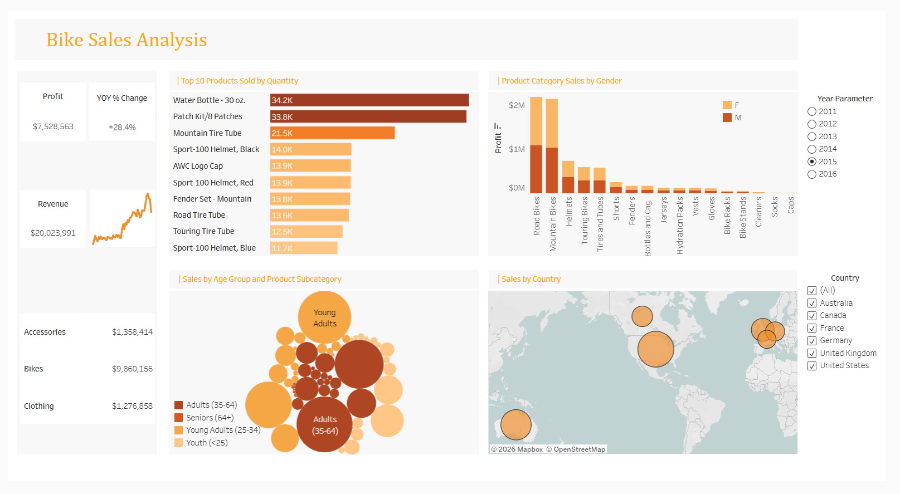

# 🚴 Bike Sales Analysis Dashboard

An interactive **Tableau dashboard** designed to analyze bike sales performance across multiple countries, product categories, and customer segments — turning raw sales data into clear, actionable business insights.

---

## 📘 Project Overview
This project focuses on uncovering key business insights from bike sales data using **Tableau**.  
The dashboard enables users to explore trends across multiple dimensions such as **product categories, age groups, gender, and geography**, helping identify growth opportunities, top-performing products, and year-on-year sales trends.

Built as part of my ongoing Tableau learning and portfolio development journey, this dashboard highlights the power of data storytelling in the retail and sports industry domain.

---

## 📸 Dashboard Preview

> 

---

## 🎯 Objectives
- To perform a comprehensive analysis of bike sales performance across 2014, 2015, and 2016.
- To identify top-selling products and highest-revenue categories.
- To understand how **age group, gender, and geography** influence sales and profit.
- To design an **interactive Tableau dashboard** that allows stakeholders to filter by year and country for dynamic trend comparison.
- To derive actionable insights that can support sales strategy and inventory decisions.

---

## ⚙️ Dashboard Features (Tableau)
- Interactive **Year Parameter filter** enabling year-on-year comparison across 2014, 2015, and 2016.
- **Country filter** for geographic drill-down across Australia, Canada, France, Germany, United Kingdom, and United States.
- Dynamic KPI cards for **Total Revenue, Profit, and YOY % Change**.
- Category-level revenue breakdown across Bikes, Accessories, and Clothing.
- Visual consistency and design best practices for intuitive sales storytelling.

---

## 📊 Key Performance Indicators (KPIs)
| KPI | Description |
|-----|-------------|
| **Total Revenue** | Overall sales revenue generated across all products and countries. |
| **Total Profit** | Net profit across all product categories and regions. |
| **YOY % Change** | Year-over-year percentage change in profit performance. |
| **Top 10 Products by Quantity** | Best-selling products ranked by units sold. |
| **Revenue by Category** | Sales contribution of Bikes, Accessories, and Clothing. |
| **Sales by Age Group** | Revenue distribution across Youth, Young Adults, Adults, and Seniors. |

---

## 📈 Visuals Included
- **Top 10 Products Sold by Quantity** — Bar chart ranking best-selling products by units sold across years.
- **Product Category Sales by Gender** — Grouped bar chart comparing profit contribution by gender across all categories.
- **Sales by Age Group and Product Subcategory** — Bubble chart segmenting sales volume by age group and subcategory.
- **Sales by Country** — Geographic map visualizing sales distribution across 6 countries.
- **Revenue & Profit KPI Cards** — Dynamic cards showing total revenue, profit, and YOY change per selected year.

---

## 🔍 Key Insights
- **Revenue surged +41.5% from $14.15M (2014) to $20.02M (2015)**, with profit peaking at $7.53M — the strongest performance year across all metrics.
- **Bikes were the highest-growth category**, jumping from $5.02M (2014) to $9.86M (2015), contributing ~49% of peak year total revenue.
- **Adults (35–64) consistently dominated sales** across all three years, followed by Young Adults (25–34) as the second largest buying segment.
- **Mountain Tire Tube was the top bike-related product** with 30.1K units (2014), 21.5K (2015), and 29.2K (2016), showing consistent demand across years.
- **2016 saw a -6.5% YOY profit dip** to $7.04M on $17.71M revenue, signaling a post-peak correction across product categories.
- **Sales spread evenly across 6 countries** — Australia, Canada, France, Germany, United Kingdom, and United States — indicating a well-diversified geographic market.

---

## 🧠 Tech Stack
- **Tableau** – Data visualization and dashboard design
- **Excel** – Data cleaning and preliminary analysis
- **Calculated Fields** – Custom metrics and KPI logic in Tableau
- **Parameters & Filters** – Dynamic year and country-based interactivity
- **Data Modeling** – Structuring sales, product, and customer data for analysis
- **Sales Analytics** – Deriving actionable insights from multi-year retail data

---

## 🗂️ Data Source & Preparation
**Data Source:**
- Publicly available bike sales sample dataset used for analytics practice.

**Data Preparation Steps:**
- Data cleaning in Excel (handled missing values, duplicates, and inconsistent labels).
- Transformation of columns like "Age Group", "Product Category", and "Country" for better categorization.
- Structured the dataset with proper date fields to enable year-on-year trend analysis.
- Created calculated fields in Tableau for profit margin, YOY change, and category-level aggregations.
- Optimized data structure for Tableau's relationship and join capabilities.

---

## 💬 Conclusion
This dashboard transformed static sales spreadsheets into a **dynamic multi-year sales intelligence tool**, enabling real-time exploration of product, demographic, and geographic performance — and uncovering growth and decline patterns that can directly inform sales and inventory strategy.

---

## 📩 Contact
💼 [LinkedIn Profile](https://www.linkedin.com/in/ganesh-pawar143/)  
📧 work.ganeshpawar03@gmail.com

---

> "Transforming data into stories that drive smarter decisions."
